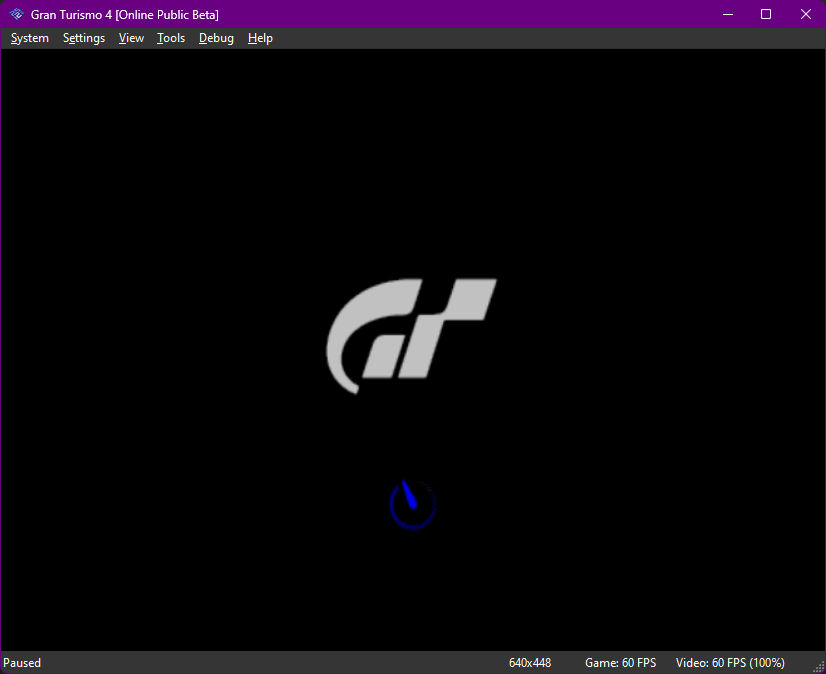

# Loading Clock Colors

This page documents the various red/blue clocks of death.

## Red Clock

<figure markdown>
  { width="600" }
  <figcaption>This is the most common one, you may have run across it before.</figcaption>
</figure>

This one indicates a disc, or I/O error, as a result of the game failing to read part of the disc for instance. The most common way to display it is by ejecting the disk while the game is loading. **It is possible** to recover from it, as the game re-tries every 1 second. It will show up once 3 I/O errors have occured in a row.

---

## Blue Clock

<figure markdown>
  { width="600" }
  <figcaption>This one is a lot less common, might be new even to you.</figcaption>
</figure>

The blue clock is caused by the game running out of memory. This only happens if you are editing the game and exceeding the game's memory limit. 

Whenever one of these memory functions are called:

* [`calloc`](https://en.cppreference.com/w/c/memory/calloc)
* [`malloc`](https://en.cppreference.com/w/c/memory/malloc)
* [`memalign`](https://linux.die.net/man/3/memalign) 

If failed, the engine will call a function called `xallocate_error_update(1)` (GT4O US: 0x5285D8) which will increment a global variable named `xallocate_error_count`. It is decremented after every successful memory allocation. If it is over 0, the game is considered out of memory - the blue clock will appear.

The checks happen at `GranTurismo4::LoadingConfigPS2::update` (GT4O US: 0x1039A8).